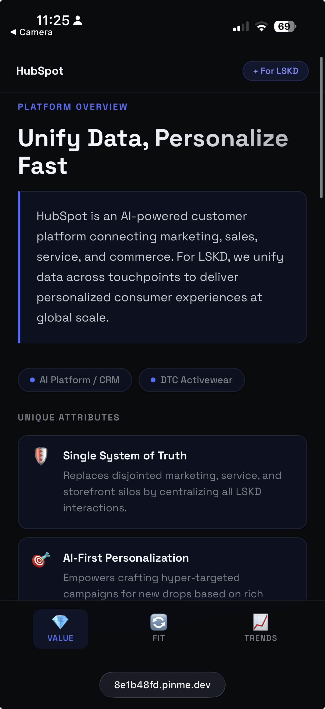
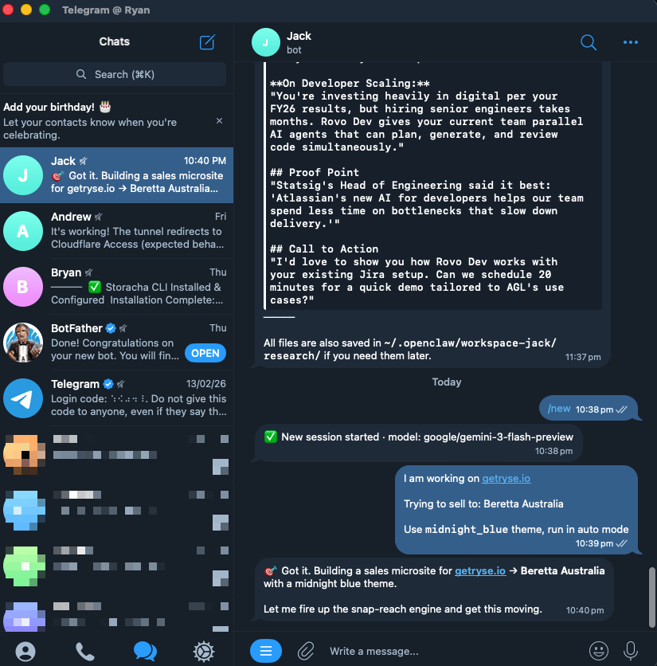

# Outreach Generator

Generate personalized B2B sales microsites from two URLs — the seller's product website and the prospect's company website. The output is a single, self-contained, mobile-first HTML file with a tailored pitch, value props, competitive insights, and a QR code for easy sharing.

## Why Use This Skill?
Salespeople often struggle to create highly personalized, engaging outreach collateral quickly. Sending generic pitch decks or text-heavy emails rarely captures a prospect's attention. Preparing for a high-value meeting by manually researching a prospect, mapping their specific pain points to your solutions, and designing a cohesive pitch is incredibly time-consuming.

The `@outreach-generator` solves this by instantly turning basic URLs into a stunning, mobile-first "microsite" that acts as a custom, interactive pitch deck. 

### When to use it?
> Imagine if you are in a networking cocktail party, and you just met a potential customer. Instead of fumbling for a business card or asking for an email follow-up, you can instantly generate a personalized microsite for them on the spot, share the QR code with them via AirDrop, and they can view it on their phone immediately to get the 'aha' moment.

## What to Expect
When triggered, the agent autonomously executes a 5-step workflow:
1. **Deep Research**: It browses the provided websites to understand your value proposition and the prospect's core business model.
2. **Pain Point Analysis**: It investigates the prospect's operations to identify their most troubling challenges and margin-burners.
3. **Sales Collateral Generation**: It crafts three personalized, highly specific markdown documents (Value Proposition, Solution Fit, Industry Trends).
4. **Adaptive Page Design**: It dynamically builds a beautifully themed HTML microsite that a prospect can digest in under 3 minutes.
5. **Instant Deployment & QR Code**: It deploys the site to IPFS and generates a QR code.


**The Result:** Impress prospects with a highly personalized web page or QR code that instantly demonstrates your deep understanding of their specific business needs, effectively separating you from the competition.

| Example Live Site | Example QR Code |
| :---: | :---: |
|  |  |

*Leave feedback: Connect and share your feedback at [LinkedIn](https://www.linkedin.com/in/ryan-yuanqing-jiang/). I'd love to learn how to invest more to help sales and account management teams land more prospects and win more deals.*

---

## Installation

You can install this skill into your agent's workspace using:

```bash
npx skills add git@github.com:Ryan-Yuanqing-Jiang/snap-reach.git
```
This will download `SKILL.md` and the `references/` directory into your agent's `.agents/skills/outreach-generator` folder.

---

## How to Use It
To use this skill, you just need to find and provide:
1. **Seller Information**: Your company's URL (or a brief description of what you are selling).
2. **Prospect Information**: The prospect's company URL (or a brief description of their business).
3. **Call to Action (CTA)**: A link to book a call, an email address, or a phone number.
4. *(Optional)* **Design Theme & Mode**: A preferred design theme or "vibe", and your preferred execution mode. *(**Interactive mode** lets you review and refine the research at each step, while **Auto mode** generates everything end-to-end without stopping.)*

Once you have this, you just `@mention` the `outreach-generator` skill in your AI assistant and provide the details.

> **💡 Real-World Tip:** The most powerful way to use this skill is with the **Openclaw agent** (or **Claude Dispatch**) directly on your phone. If you're walking into a meeting or just met a prospect, you can ask Openclaw to run this skill and generate a highly personalized pitch in minutes, right from your mobile device. Otherwise, it works seamlessly with any AI agent that supports skills.



### Example Prompts

Depending on your needs, you can customize the inputs (Information, CTA, Theme, and Execution Mode). Here are 3 variations demonstrating the different ways to prompt the agent:

**1. The "Kitchen Sink" (Full URLs & Auto Mode)**
*Use this when you have specific URLs, exact links for booking a call, and want the agent to run end-to-end without stopping for feedback.*
> "@outreach-generator Prepare a sales page for my meeting next week. I want to run in **Auto mode**.
> Seller: https://www.seller.com 
> Prospect: https://www.prospect.com
> Theme: Use the `luxury_noir` design theme.
> CTA: 'Book a 25-min call' linking to https://calendly.com/my-link"

**2. Interactive Co-creation (Descriptions & Vibe Match)**
*Use this when you only have company descriptions rather than URLs, want to describe a "vibe" instead of an exact theme name, and want to iteratively review the agent's work at each step.*
> "@outreach-generator Let's build a pitch page in **Interactive mode** so I can review your research before generating the HTML.
> Seller Info: We provide AI-driven logistics software for trucking companies.
> Prospect Info: A mid-sized regional freight company struggling with fuel costs.
> Theme: Make it look professional but high-energy and modern.
> CTA: Email me directly at sales@seller.com"

**3. Direct Outreach (Phone CTA & Auto Mode)**
*Use this for a quick generation where you provide a phone number as the primary contact, and let the agent automatically pick the most suitable design theme.*
> "@outreach-generator Make a personalized pitch page. Run in **Auto mode**.
> Seller: https://www.seller.com
> Prospect: https://www.prospect.com
> CTA: 'Call us today' at +1-800-555-0199"

### Requesting a Specific Design Theme
By default, the skill will try to automatically match a theme to either the prospect's website or your brand's website. However, you can explicitly enforce a theme by including it in your prompt. 

Available themes:
* `midnight_blue` (Default - Dark/Blue: Best for Tech, SaaS, AI, consulting)
* `clean_frost` (Light/Cyan: Best for Modern SaaS, fintech, health)
* `luxury_noir` (Dark/Gold: Best for luxury, fashion, premium brands)
* `corporate_trust` (Light/Navy: Best for enterprise, finance, legal)
* `warm_earth` (Light/Green: Best for wellness, food, organic, retail)
* `vibrant_tech` (Dark/Neon Green: Best for startups, gaming, dev tools)

### Advanced Prompting Tips
* **Add Context:** If you know specific challenges the prospect is facing that aren't obvious on their website, include them in the prompt (e.g., *"Focus on their recent supply chain issues mentioned in the news."*).
* **Define the Outcome:** Specify if you want to push for a specific next step, like a *"Technical Discovery Call"* or a *"Free Audit"*.
* **QR Codes:** The skill automatically deploys the site to IPFS and generates a QR code. Ask the agent for the QR code image path if you want to embed it in a presentation.

---

## Folder Structure

When packaging this for distribution, ensure the following structure is maintained so the agent can find all templates:

```text
├── SKILL.md                          # The core agent instructions
└── references/
    ├── landing_page_template.md      # The web page component catalog
    ├── prospect_research.md          # Research sub-agent instructions
    ├── scripts/
    │   └── generate_qr.py            # Used for the QR code step
    └── design_themes/                # CSS variable overrides
        ├── clean_frost.md
        ├── corporate_trust.md
        ├── luxury_noir.md
        ├── midnight_blue.md
        ├── vibrant_tech.md
        └── warm_earth.md
```
